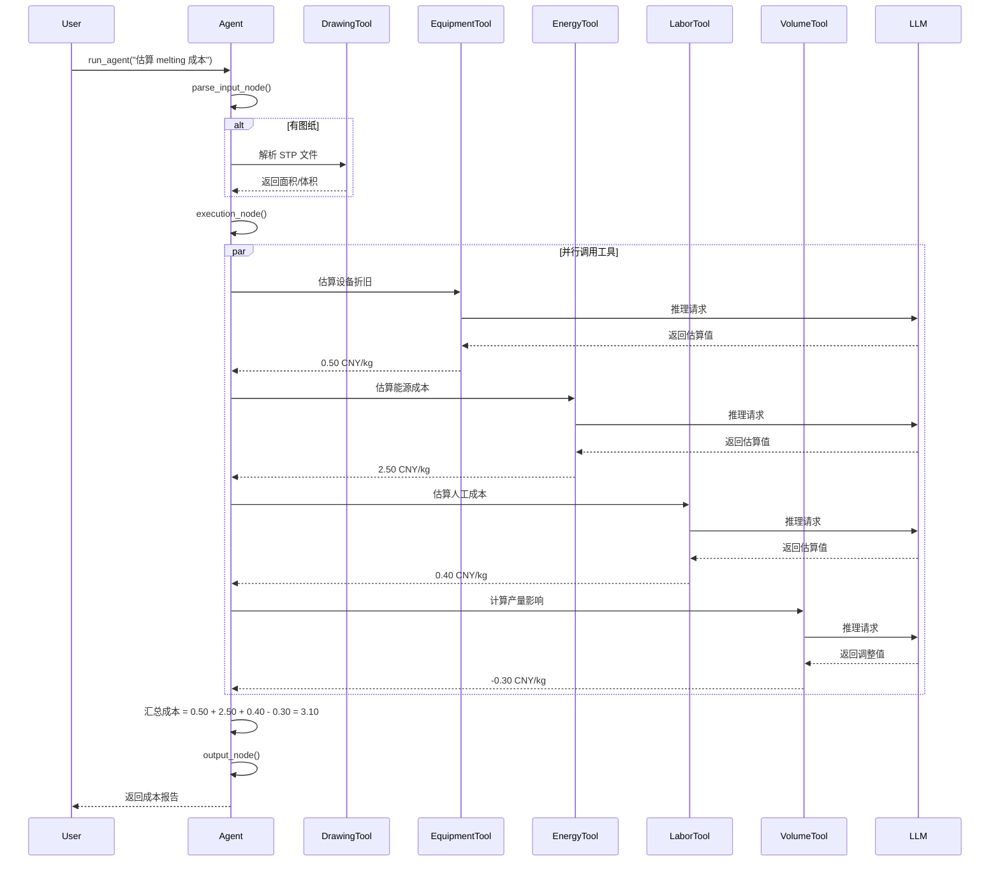

# Manufacturing Cost Agent 架构设计

## 系统概述

Manufacturing Cost Agent 是一个基于 LangGraph 的智能工艺成本估算系统，采用模块化设计，通过 LLM 驱动的工具链实现自动化成本推理。

## 核心架构

```
┌─────────────────────────────────────────────────────────┐
│                      User Interface                      │
│              (run_agent() Function Call)                 │
└────────────────────┬────────────────────────────────────┘
                     │
                     ▼
┌─────────────────────────────────────────────────────────┐
│                    LangGraph Workflow                    │
│  ┌─────────────┐   ┌─────────────┐   ┌─────────────┐   │
│  │Parse Input  │──▶│  Execution  │──▶│   Output    │   │
│  │    Node     │   │     Node    │   │    Node     │   │
│  └─────────────┘   └──────┬──────┘   └─────────────┘   │
│                            │                             │
│                            │                             │
│         ┌──────────────────┴──────────────────┐         │
│         │         Tool Orchestration          │         │
│         └────────────┬────────────────────────┘         │
└──────────────────────┼──────────────────────────────────┘
                       │
       ┌───────────────┼───────────────┬──────────────┐
       │               │               │              │
       ▼               ▼               ▼              ▼
┌─────────────┐ ┌─────────────┐ ┌──────────┐ ┌──────────┐
│  Drawing    │ │ Equipment   │ │ Energy   │ │  Labor   │
│   Parser    │ │Depreciation │ │   Cost   │ │   Cost   │
│    Tool     │ │    Tool     │ │   Tool   │ │   Tool   │
└─────────────┘ └─────────────┘ └──────────┘ └──────────┘
       │               │               │              │
       └───────────────┴───────────────┴──────────────┘
                       │
                       ▼
              ┌─────────────────┐
              │   Azure OpenAI  │
              │     GPT-4o      │
              └─────────────────┘
```

## 组件详解

### 1. Agent 核心 (agent.py)

**职责**：
- 工作流编排（LangGraph）
- 状态管理
- 工具调用协调

**关键类**：

```python
class AgentState(TypedDict):
    messages: List[BaseMessage]          # 对话历史
    drawing_data: Optional[Dict]         # 图纸数据
    production_volume: Optional[int]     # 产量
    location: Optional[str]              # 地点
    cost_breakdown: Optional[Dict]       # 成本分解
```

**工作流节点**：

1. **parse_input_node**: 解析用户输入
2. **execution_node**: 执行工具调用
3. **output_node**: 格式化输出

### 2. 工具层 (tools/)

#### 2.1 图纸解析工具 (DrawingParserTool)

**技术栈**: CadQuery

**功能**:
- 读取 STP/STEP 文件
- 计算表面积（mm²）
- 计算体积（mm³）

**返回格式**:
```python
{
    "surface_area": 1000.0,
    "volume": 500.0,
    "unit_area": "mm²",
    "unit_volume": "mm³"
}
```

#### 2.2 设备折旧工具 (EquipmentDepreciationTool)

**推理逻辑** (LLM):
1. 识别工艺所需设备类型
2. 估算设备采购成本
3. 确定折旧年限
4. 计算年度折旧
5. 分摊到单位产品

**默认值**（LLM 失败时）:
- melting: 0.50 CNY/kg
- casting: 1.20 CNY/kg
- machining: 0.80 CNY/kg
- inspection: 0.30 CNY/kg

#### 2.3 产量影响工具 (ProductionVolumeTool)

**规模效应模型**:

| 产量范围 | 成本调整 |
|---------|---------|
| < 100k | +20% ~ +50% |
| 100k - 500k | -5% ~ +10% |
| 500k - 1M | -10% ~ -20% |
| > 1M | -20% ~ -30% |

#### 2.4 能源成本工具 (EnergyCostTool)

**考虑因素**:
- 电力消耗（kWh）
- 水资源消耗（m³）
- 天然气消耗（m³）
- 地区能源价格差异

**地区电价参考**:
- 浙江: 0.60-0.70 CNY/kWh
- 江苏: 0.55-0.65 CNY/kWh
- 广东: 0.65-0.75 CNY/kWh

#### 2.5 人工成本工具 (LaborCostTool)

**计算公式**:
```
人工成本 = (基础工资 + 社保公积金) × 人员数量 / 产量 / 单件重量
```

**自动化程度影响**:
- melting: 中等自动化（2-3人）
- casting: 高自动化（2-4人）
- machining: 高自动化（1-2人/班次）
- inspection: 半自动化（3-5人）

### 3. LLM 层 (Azure OpenAI)

**模型**: GPT-4o

**用途**:
1. 理解用户查询意图
2. 推理工艺成本构成
3. 估算具体数值
4. 生成自然语言解释

**Prompt 设计原则**:
- 明确任务目标
- 提供上下文信息
- 限定输出格式
- 包含默认值作为参考

## 数据流

### 典型执行流程



## 扩展性设计

### 1. 添加新工艺类型

只需在 `agent.py` 中添加工艺名称，LLM 会自动推理：

```python
all_processes = ["melting", "casting", "machining", "inspection", "welding"]
```

### 2. 添加新的成本维度

创建新工具并注册：

```python
# 新建 tools/quality_cost_tool.py
class QualityCostTool:
    # ... 实现 ...

# 在 agent.py 中注册
quality_tool = QualityCostTool(llm).as_tool()
tools.append(quality_tool)
```

### 3. 自定义 LLM 提示词

每个工具的 `run()` 方法中都有提示词模板，可根据需要修改：

```python
prompt = ChatPromptTemplate.from_template("""
你是一名 [角色]。请估算 [任务]。

输入参数：
- 参数1: {param1}
- 参数2: {param2}

输出要求：
- 格式: [格式说明]
- 单位: [单位]
""")
```

### 4. 集成外部数据源

可以在工具中添加 API 调用：

```python
def run(self, ...):
    # 调用外部价格API
    response = requests.get("https://api.example.com/prices")
    data = response.json()
    
    # 结合 LLM 推理
    # ...
```

## 性能考虑

### 1. 缓存机制

建议对相同查询进行缓存：

```python
from functools import lru_cache

@lru_cache(maxsize=100)
def cached_tool_call(process, volume, location):
    # ...
```

### 2. 并行处理

不同工艺的估算可以并行：

```python
from concurrent.futures import ThreadPoolExecutor

with ThreadPoolExecutor() as executor:
    futures = {
        executor.submit(tool.invoke, args): process
        for process in processes
    }
```

### 3. 异步调用

使用异步 LLM 调用提升吞吐量：

```python
from langchain_openai import AzureChatOpenAI

llm = AzureChatOpenAI(..., async_mode=True)
```

## 安全性设计

### 1. 输入验证

所有工具参数使用 Pydantic 验证：

```python
class ToolArgs(BaseModel):
    process: str = Field(..., pattern="^(melting|casting|...)$")
    volume: int = Field(..., gt=0, lt=100000000)
```

### 2. 异常处理

每个工具都有 try-except 和默认值：

```python
try:
    result = llm.invoke(...)
except Exception as e:
    print(f"Error: {e}")
    return default_value
```

### 3. API 密钥保护

使用环境变量管理敏感信息：

```python
load_dotenv()
api_key = os.getenv("AZURE_OPENAI_API_KEY")
```

## 测试策略

### 1. 单元测试

测试每个工具的独立功能：

```python
def test_equipment_tool():
    tool = EquipmentDepreciationTool(llm)
    result = tool.run("melting", 1_000_000)
    assert 0 < result < 5
```

### 2. 集成测试

测试完整工作流：

```python
def test_full_workflow():
    result = run_agent("估算 melting")
    assert "melting" in result['processes']
```

### 3. 回归测试

保存历史结果进行对比。

## 部署建议

### 1. 生产环境配置

```yaml
# docker-compose.yml
services:
  agent:
    image: manufacturing-agent:latest
    environment:
      - AZURE_OPENAI_API_KEY=${API_KEY}
      - AZURE_OPENAI_ENDPOINT=${ENDPOINT}
    ports:
      - "8000:8000"
```

### 2. 监控指标

- LLM 调用次数
- 平均响应时间
- 错误率
- 缓存命中率

### 3. 日志记录

```python
import logging

logging.basicConfig(level=logging.INFO)
logger = logging.getLogger(__name__)

logger.info(f"Estimating cost for {process}")
logger.error(f"Tool failed: {e}")
```

## 未来优化方向

1. **多模态支持**: 直接处理 PDF 图纸
2. **知识图谱**: 构建工艺知识库
3. **强化学习**: 从历史数据学习最优估算策略
4. **可解释性**: 提供详细的推理过程
5. **实时更新**: 集成实时价格 API

---

**文档版本**: 1.0  
**最后更新**: 2024-11-10
